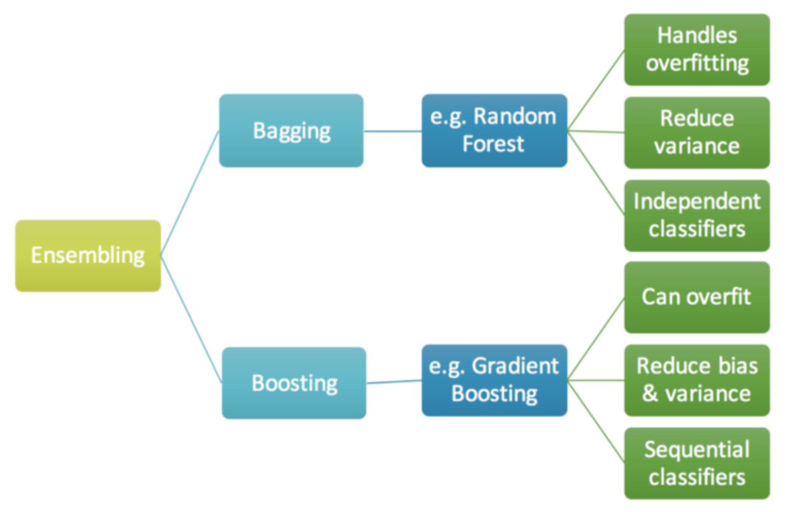
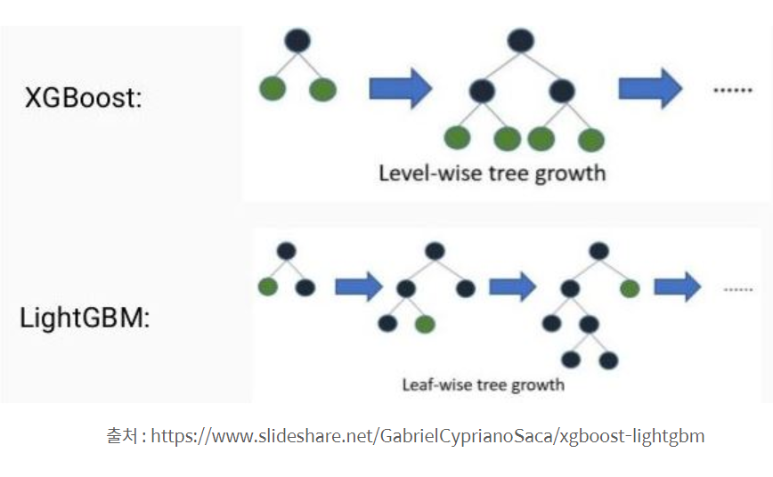

# [Kaggle IEEE-CIS FraudDetection](https://www.kaggle.com/c/ieee-fraud-detection)

Ybigta Team project, Summer 2019

## Contents

1. [Data Preprocessing](#data-preprocessing)
2. [Exploited Methods and Techniques](#exploited-methods-and-techniques)
3. [Limitations and Future Works](#limitations-and-future-works)

## Data Preprocessing

### Identity Data

Identity data contains features such as ID01~38, Device Type, Device Info. Since the informations from this data are identification signatures, we treated them as categorical values. Preprocessing on this data was mainly based on **one-hot encoding**; but given the massive variety of categories and excessive NaN values, we created **binary columns** for some features, indicating *whether the value is NaN or not*.

* Device Type
  * Due to the high ratio of NaN values, we created binary column indicating whether the value if NaN or not.
* Device Info
  * Given the high dependency to `Device Type` , we did not include this feature in our model training.
* id01 - id38
  * Selected six most representative columns based on correlation coefficient.

### Transaction Data

* ProductCD, addr1, addr2
  * Preprocessed by one-hot encoding.
* card1 - card6
  * We combined all the card columns into a single feature and treated each combination as credit card signature.
* P_emaildomain, R_emaildomain
  * Imputed missing values with random sampling.
* TransactionAmt
  * In order to mitigate skewness of the data, we removed outliers and log-transformed the data.
  * We found that high percentage of the fraud data have decimal places more than 15, so created a column indicating the number of decimal places.
* TransactionDT
  * We found that each value is a representation of time in seconds, so we broke down the value into more specific time features(i.e. hour, minute, second, date)
* M columns, D columns
  * Due to the high ratio of NaN values, we created binary column indicating whether the value if NaN or not.
* V columns
  * Imputed missing values with mean value.
  * Reduced dimensions by **Principal Component Analysis**.

## Exploited Methods and Techniques

### PCA (Principal Component Analysis)

PCA reduces dimensions while preserving the original variance of data. The eigenvectors of the data's covariance matrix are considered to be `principal components`, and a new orthgonal coordinate system based on the eigenvectors is defined to represent the data in smaller dimensions.  

Reference: https://en.wikipedia.org/wiki/Principal_component_analysis

### SMOTE (Synthetic Minority Oversampling Technique)

SMOTE is an oversampling technique to mitigate imbalance in the data. As the percentage of fraud transactions in the given data is very low(i.e. 3.5%), we decided to use SMOTE in order to prevent unwanted situations such as high accuracy with low recall.  

SMOTE is based on the concept of KNN(K-Nearest Neighbors). It takes a sample of data that we wish to oversample, consider its KNN, then take a vector between the original data point and a point from its KNN. To create a oversampled data, it multiplies the vector by a random number in a range of 0 and 1.  

Reference: https://en.wikipedia.org/wiki/Oversampling_and_undersampling_in_data_analysis#SMOTE

### LGBM (Light Gradient Boosted Machine)

* Boosting

  * Ensemble meta-algorithm that convert weak learners to strong ones. A weak learner is defined to be a classifier that is only slightly correlated with the true classification, while a strong learner is a classifier that is well-correlated with the true classification.
  * Weak classifiers are learned iteratively, which are then added up to be a stronger classifier. Data weights are readjusted after the adding up, a.k.a. *re-weighting*.
  * We adopted boosting algorithm given the volumne and obscurity of the data.

* XGBoost vs LGBM

  

  * We first tried out XGBoost(due to its history in Kaggle competitions), which is a **decision-tree-based ensemble** Machine Learning algorithm. XGBoost takes level-wise approach when computing the best splits; i.e. *pre-sorted* algorithm and *histogram-based* algorithm.
  * With disappointment in the performance of our initial model, we shifted to LGBM, which features lighter and faster training with better accuracy. Unlike XGBoost, LGBM computes the best splits using a novel technique called **GOSS**(Gradient-based One-Side Sampling). [More on LGBM](https://towardsdatascience.com/what-makes-lightgbm-lightning-fast-a27cf0d9785e)
  * Owing to the training efficiency and advanced splitting techniques of LGBM, we could score `0.9023 AUC` as our final performance.

Reference: https://3months.tistory.com/368, https://en.wikipedia.org/wiki/Boosting_(machine_learning), https://mlexplained.com/2018/01/05/lightgbm-and-xgboost-explained/, https://towardsdatascience.com/lightgbm-vs-xgboost-which-algorithm-win-the-race-1ff7dd4917d

## Limitations and Future Works

### Data Preprocessing

1. For the sake of time efficiency, we splitted the data by features and worked independently in the preprocessing stage. This however resulted in extra work of combining the whole data.
2. Due to privacy concern, a huge portion of the features were masked. Looking back from now, our team might have been too intimidated with it and tried to do too much work on the data. It could have been better to train the model with less preprocessed data.

### Model Training

1. Due to time constraint, we couldn't go through much fine-tuning. We mostly depended on heuristic tuning, but it could have been better to do more thorough parameter search(i.e. grid search).
2. While we only tried SMOTE to balance out the data, there are some other techniques to use; or we could have just used the imbalanced data as it is.

